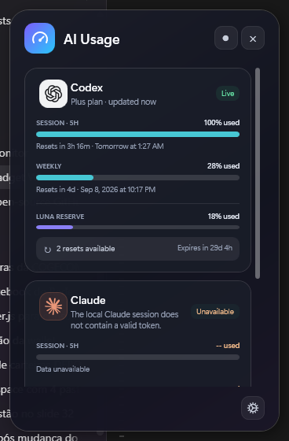
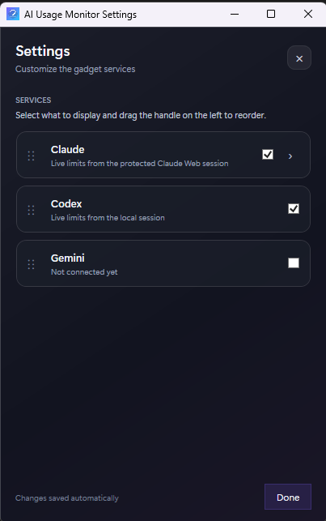

# AI Usage Monitor

A lightweight Windows desktop gadget that brings AI service usage limits into a single, glanceable view.

> [!NOTE]
> This project is in an early stage. Codex, Kiro, and Antigravity usage are read from their local signed-in clients, while Claude usage is read from a protected Claude Web `sessionKey`. Gemini remains marked as not connected and does not display fabricated metrics.

## Features

- Minimal, transparent, frameless, draggable WPF gadget with no dashboard buttons.
- Right-click menu for settings, font size, always-on-top mode, About, and exit.
- System tray icon with show/hide controls; the gadget stays out of the taskbar.
- Optional per-user startup with Windows, configurable from Settings without administrator access.
- Independent settings window that leaves the live gadget visible.
- Content-driven autofit that opens at the minimum width and grows horizontally to keep token totals, estimated cost, and visible reset text from overlapping or being clipped.
- Single-surface provider layout with subtle separators instead of nested cards.
- Combined tokens used today and estimated model cost across the providers selected in Settings: Codex, Claude, Kiro, and Antigravity.
- Separate 5-hour session and weekly usage indicators.
- Codex reserve usage and reset-credit information.
- Automatic Codex refresh using the local signed-in session.
- Automatic Claude refresh through a protected Claude Web session.
- Automatic Kiro refresh through the signed-in local CLI.
- Automatic Antigravity refresh through the loopback service exposed by the running IDE.
- Fixed provider-aware refresh intervals: five minutes for Codex and Kiro, and one minute for Claude and Antigravity.
- Configurable provider visibility and ordering with provider icons and a floating drag preview.
- Compact, scroll-free gadget layout that keeps all selected services visible.
- About tab inside Settings with project, author, license, and version information.
- Automatic update availability checks through the latest stable GitHub Release.

Preferences are stored in `%APPDATA%\AIUsageMonitor\settings.json`.
The optional Windows startup entry is stored for the current user under `HKCU\Software\Microsoft\Windows\CurrentVersion\Run`.

### Connect Claude Web

1. Open `https://claude.ai/settings/usage` and sign in.
2. Open the browser developer tools (`F12`), then go to **Application** > **Cookies** > `https://claude.ai`.
3. Copy only the value of the `sessionKey` cookie. It begins with `sk-ant-`.
4. In AI Usage Monitor, open **Settings**, paste the value under **Claude Web connection**, and press `Enter` or select **Save & connect**.

The value is checked before it is saved. AI Usage Monitor never displays the saved value again.
The same steps are shown inside the expanded Claude card whenever Claude Web is disconnected.

## Screenshots

AI Usage Monitor keeps token totals, estimated cost, usage windows, reserve, and reset information visible at a glance.

### Gadget

The flat gadget stays compact while combining live Claude and Codex usage on a single surface.



### Settings

The independent settings window leaves the gadget running while services are shown, hidden, reordered, or connected.



## Requirements

- Windows 10 or later.
- [.NET 8 SDK](https://dotnet.microsoft.com/download/dotnet/8.0) or later.
- A signed-in Codex session and/or a Claude Web session for their live usage data.
- Kiro CLI installed and signed in for Kiro limits; local Kiro session files are used for its token total.
- Antigravity IDE installed, open, and signed in for Antigravity limits and token totals.

## Run locally

```powershell
git clone https://github.com/bernaction/AIUsageMonitor.git
cd AIUsageMonitor
dotnet restore
dotnet run
```

## Privacy and authentication

- The app reads `~/.codex/auth.json` only to query usage limits for the account already signed in on the device.
- Paste only the `sessionKey` value from the `claude.ai` browser cookies in Settings. The app validates it before saving it in Windows Credential Manager.
- Credentials remain in memory only while requests are made and are never written to the regular settings file.
- For the token total, the app scans local Codex and Claude JSONL histories and extracts only timestamps, model names, message identifiers, and token-usage counters. Prompt and response text is not stored or displayed by AI Usage Monitor.
- Kiro session files are read locally. Antigravity data is requested only from the IDE service bound to the local computer; its temporary connection token is kept in memory and is never displayed or persisted by AI Usage Monitor.
- Token costs are estimates derived from model pricing and may exclude unknown models; they are not provider invoices or subscription charges.
- Usage data is requested from the Codex/ChatGPT endpoint and the browser-facing Claude Web endpoint. These integrations may stop working if their endpoints change.
- The app checks the public GitHub Releases API for newer stable versions. No GitHub credentials are used.

Never commit `auth.json`, access tokens, or other credentials. See [SECURITY.md](SECURITY.md) for reporting security issues.

## Project structure

```text
Models/                 Usage and settings data models
Services/               Provider integration and settings persistence
App.xaml                WPF application resources
MainWindow.xaml         Window layout and styles
MainWindow.xaml.cs      UI behavior and provider presentation
AIUsageMonitor.csproj   .NET project configuration
build-release.ps1       Local release build & zip packaging script
docs/DISTRIBUTION_GUIDE.md Packaging, anti-false positive and release guide
```

## Contributing

Contributions are welcome. Please read [CONTRIBUTING.md](CONTRIBUTING.md), open an issue for significant changes, and submit improvements through pull requests.

## Roadmap

- Define the packaging, download, signature verification, and rollback strategy before enabling automatic updates.
- Add automated parsing tests for the Claude Web usage responses.
- Add a live Gemini integration with an unavailable-state fallback.
- Extract provider cards into reusable components.
- Persist window position, size, and theme.
- Add optional Windows startup.
- Add automated tests for settings persistence and the remaining provider responses.

## License

Licensed under the [MIT License](LICENSE).
